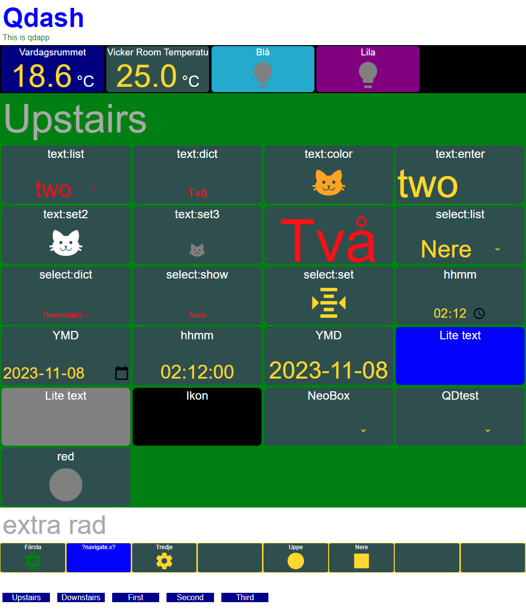

# Qdash
## What is Qdash?
Qdash is an environment for makeing web pages that display Home Assistant entities as boxes.

Qdash is based on:
- HA web server 
- HA automation blueprint
- Mosquitto MQTT add-on  
- Nginx Manager add-on
- one short CSS file
- one pretty simple JavaScript file
- external CSS for material design icons 
- external JavaScript MQTT client library 

## Simple HTML

A Qdash web application is set up as a simple HTML page defining a set of **entity box**es, that reflects and/or controls an entity.
For example a box for a typical sensor shows a numeric followed by a unit of measure and a switch is a clickable icon that changes color.

    <body onload="start();"> 
       

          

          

          

          

          

          

       

    </body>

A box may also be customized by adding options to the HTML element, e.g.:

`

`

The Qdash web application communicatates with HA using MQTT. 
Access rules are implemented using Nginx and MQTT user/password options.
MQTT configuration and page layout is set up as a few lines of JavaScript code.  

## Back-end
To serve the web application there must be an automation to send state changes to the web application and receive requests from the web application. This automation is based on a blueprint. The automation also provides information about the entities, such as name, area and unit of measurements. When the web application is started, it requests this information. 

# Boxes

## Behavior
The table below describes how entities of a domain may be visulized and controlled using an entity box. The box behavior is set up directly in the HTML element for the box. The options to put as element arguments are described in [Options](#options).

|domain       |  options        | box behavior  |
|-------------|-----------------|---------------|
|binary_sensor||show state as colored icon|
|binary_sensor|show|show state as colored icon|
|input_boolean||show state as colored icon, click to toggle on/off|
|input_boolean|show|show state as colored icon|
|input_button||show state as colored icon, click to trig|
|input_datetime||pick a time and confirm|
|input_datetime| date|pick a date and confirm|
|input_datetime| show|show time as text|
|input_datetime| show date|show date as text|
|input_number |show|show numeric value (optionally with prec and uom) |
|input_number||toggle states using up/down buttons|
|input_number| prec show dict| lookup state, show alias as text |
|input_number|range|select state and confirm|
|input_select||toggle states using up/down buttons|
|input_select |set color |show state as colored icon, click to trig|
|input_select |show color|show state as colored icon| 
|input_select |show dict|lookup state, show as text |
|input_select| dict|select alias for state and confirm|
|input_select| list|select state and confirm|
|input_select| show|show state as text|
|input_text||enter state as text| 
|input_text |set color|show state as colored icon, click to trig|
|input_text |show color|show state as colored icon|    
|input_text |show dict|   lookup state, show as alias |
|input_text |show |show state as text |
|input_text| dict| select alias for state and confirm|
|input_text| list |select state and confirm|
|light ||show state as colored icon, click to toggle on/off|
|light| bright|change brightness using up/down buttons|
|light| show|show on/off state as colored icon|
|script||show as icon, click to run|
|script|set|show as icon, click to run script with arguments|
|script|list|select arguments, click to run script with arguments|
|script|dict|select alias for arguments, click to run script with arguments|
|sensor[^1]| |show numeric value (optionally with prec and uom) |
|sensor[^1]|| dict |lookup state, show as alias |
|sensor[^1]|| |show state as text|
|switch ||show state as colored icon, click to toggle on/off|
|switch| show|show state as colored icon|

[^1]: Sensors are regarded as numeric if there is *uom* or *prec* specified for it. 

## Options 

The following options are available, but have no meaning if not relevant for the domain:
| option |  meaning | example |
|--------|----------|---------|
| fill="COLOR"  |         	COLOR gives the color of the box. A CSS color name or a code may be used.   |  `
` |  
| name="NAME"    |       	NAME is overriding the entity's friendly_name presented in the box name line. |  `
` |
| uom="UOM"  |             	UOM is overriding the entity's unit_of_measurement. An empty string may be used to tell that this is not a numeric. A space may be used to tell this is a numeric without unit. | `
` |
|  prec="PREC"    |         	PREC (precision) is the number of decimals (0..) to be used for a numeric state. Without this option the state is presented without any change. |  `
` |
| icon="ICON"    |          For boxes that use an icon, the icon may be set. Note that HA front-end uses default icons but such an icon is not regarded as an entity attribute. However, if an icon is explicitly choosen in HA, this icon becomes an entity attribute. Providing icon="ICON" means that mdi:ICON is to be used. If there is no icon defined, a square (mdi:square) will be used. | `
` |
| show         |            For entities that normally may be changed, the show option means the entity state can't be changed.  | `
` | 
| range="MN,MX,STEP"  |       MN and MX are min and max values and STEP is step value for domain input_number | `
` |
| list="LIST"         |     LIST is a set of options for selectable items (input_text and input_select). The box will  | `
`  |
| dict="DICT"         |     DICT is a set of key:value pairs of format a:A,b:B,c:C,d:D. It is used for selectable items  (input_text and input_select). |  `
`|
| set="VALUE"         |     VALUE is a value to be set for the entity when clicking.  |  `
` |
| color="COLOR"         |   COLOR is a coloring scheme with a set of key:color pairs. Assigning an asterik (\*) as key, defines the color for all other options. |  `
` |
| color="COLOR"         |   COLOR may also be used as a coloring scheme (key:color pairs) for numercal values. The key is the lowest value for the color.  | `
` |
| look="STYLE"  |           A box's state is by default presented with a specific font and font color. STYLE may override this whith a CSS style string.  |  `
` |
| bright    |       	Entities of domain light are by default presented as a clickable icon that toggles the light. The `bright` option instead gives the possibility to change the light's brightness. |  `
` |
| date    |       	Boxes for entityies of domain datetime are by default handling hours and minutes. The `date` option makes the box handle a date. |  `
` |

## Other boxes

### View box
A view box is used for turning on and off sections, see [Sections](sections). 
The **view** attribute is mandatory. The format is `view="Y:X,Y,Z"` with meaning: hide sections X, Y and Z and then unhide Y.  
By default the box has a clickable square icon.

Optional attributes are 
- name 
- fill 
- icon 
- look

An example:  `

`

### Empty box 
Empty boxes are for structuring the page. An empty box is just a colored box, but it may have a name. 
The **empty** attribute is mandatory.
Optional attributes are 
- fill
- name

An example: `

 `

### Custom box
A custom box is intended for any kind of content, within the limits of what can be visualized.
The **custom** attribute is mandatory.
Optional attributes are 
- fill
- name 

An example: 

    

       
Do some magic

       
    
  

## HTML page structure

## Mandatory elements
Mandatory parts of a Qdash HTML page are:
- one JavaScript function to be called when the page is loaded 
- body element,  `<body onload="... >...</body>` containing one or more section elements.
- section elements  `
...
`, each containing one or more box elements.
- box elements `

`, each containing HTML code for viewing the box's name and current state and for changing state. 

## Sections

A section is a set of boxes and may have a name. 
Boxes in an unnamed section are always visible. 
The visibilty of boxes in a named section can be controlled:
- If the section has a `show` option it will be unhidden from start.
- Calling the function `qd.showSection` will hide and unhide sections.
- A box with option `view` will provide a clickable button that unhides one of a set of sections.

For section, the following options are available:
| option |  meaning | example |
|--------|----------|---------|
| section        |Tells that it is an unnamed section. Boxes of unnamed sections are always visible.  |  `
` |
| section="NAME" |NAME is the name of an named section. |  `
` |
| show           |Boxes of the sections are visible from start.  | `
` | 
| fill="COLOR"   |COLOR gives the color round the boxes of the section. A CSS color name or a code may be used.   |  `
` |  
| columns="N"    |N is the number of boxes on each row in the section.  |  `
` |  

## Multiple sections and section groups
It is possible to define multiple sections, each with a set of boxes. 
    
    

       

       

       

       

    

    

       

       

       

       

    

At start, only the upstairs entities are visible. The last box of each section  Call the function `qd.showSection( "upstairs:upstairs,downstairs" )` to switch between sections. 
Also the sections may be divided into groups. In such a group, only one section will be visible at a time. In the example below there is a last section with four boxes for controlling the two groups.
    
    <!-- upstairs/downstairs group --> 
    
...

    
...

    <!-- climate group --> 
    
...

    
...

    <!-- navigation section, always visible --> 
    

       

       

       

       

    

## Adding extra elements

Extra `
` elements for text, buttons, images etcetera, may be added 
- above the sections
- above the boxes in a section
- below the boxes in a section
- below the sections

Such elements must be of `class="nobox"`.

    <body onload="start();"> 
        
Above sections
   
        

          
In section
   
          

          
In section
   
        

        
After section

    </body>

The styling of extra element is dependent on the section. 
A section with only extra elements may be added, for example.
   
      
      

          <h1>Qdash</h1>
          
This is a web application
 
      
   
   
   

The default styling of some common element types are:

       h1     { color: blue;  font-size: 100%; }
       h2     { color: blue;  font-size:  80%; }
       p      { color: black; font-size:  50%; }

To change or add styling, add a 

## Configuration
Configuration is made when the page is loaded, see [Start function](#start_function).    

There are tho types of configuration
- MQTT configuration, in mqtt.config
- application configuration, in qd.config

A configuration item may be mandatory (M) or optional (O).

### The mqtt.config object  

item       |  M/O  | description  
-----------|-------|---------------|
userName |M| MQTT user name. 
password  |M| MQTT password to give access to HA MQTT broker. User name/password pairs are defined in Mosquitto add-on configuration. 
host |M| Web address to be used to connect to MQTT broker.
config.port |M|Port to be used to connect to MQTT broker.
useSSL |M| When set to true, secure websocket protocol is used. This is strongly recommended when accessing the MQTT broker from internet.
client |M| Name of the MQTT client. To make a unique name the following expression may be used: `'qdash_'+ Math.floor(Date.now() / 1000);`. 
timeout |M| Timeout in ms for MQTT connection retrial. 

### The qd.config object  

item       |  M/O  | description  
-----------|-------|---------------|
stateTopic |M| MQTT topic for updating entity state. Sent from HA to the web application. 
buttonTopic |M| MQTT topic to be used for telling HA that a clickable icon was clicked. 
requestTopic|M| MQTT topic for requesting HA for entity information. 
responseTopic|M|MQTT topic for providing entity information. Sent from HA to the web application.  
columns|O| Number of box columns.This value may be overridden for each section. Default is 2.
width|O| Percent of the total width to be used for the box columns. Default is 100.
consoleLog|O| When true, debug information is sent to console.log. This is default.
divLog|O|When set to an HTML element id in the HTML code, the debug information is also put in that element. Default is that no such logging is done.
onConfigBox|O|Custom function that is called for each entity response. See [Hook functions](#hook_functions).
onUpdateBox|O|Custom function that is called for each state update. See [Hook functions](#hook_functions).
defaultonoffcolor|O| Colors to be used for on/off state indication. Default is "on:gold,off:grey,*:red".
lookup |O| Pre-defined color schemes. See [Lookup strings](#lookup_strings).

# Start function
    
    
### URL request parameters
Config parameters may be set from url request parameters, for example:
`config.columns = getUrlParam('columns', '2' );`

   
## MQTT sequence

          User       Browser                            Home Assistant 
                                    
          URL ------------------------- GET ----------> web server
                     onLoad()      <--- page ---------- web server
                     onConfigDone()
                     mqttConnect() ----> MQTT broker    
                     onConnect()   <---- MQTT broker           
                     nextRequest() -----/request -----> automation                       
                     onMessage()   <----/response ----- automation         
                     nextRequest() -----/request  ----> automation                       
                     onMessage()   <----/response ----- automation         
                     ...
                     onMessage()   <----/state -------- automation <--- state change event
                     onMessage()   <----/state -------- automation <--- state change event
                     ...
           click --> onClick()     -----/button ------> automation ---> state change request
                     onMessage()   <----/state -------- automation <--- state change event
                     
 # Security
 
 - HTTPS is used 
 - Nginx is set up to limit access to other pages 
 - Nginx user/password is required to get page
 - MQTT broker is accessed via Nginx using Web Sockets Secure
 - MQTT user/password is required 
 - MQTT access control list is used to restrict allowed topics 
 - Automation restricts the set of entities to be accessed

## Discussion on access credentials 
There are two types of access credentials involved:
- **page access** - username and password required to get access to the web pages. The page access control is implemented in Nginx.
- **MQTT access* - username and password (**app MQTT user/pass**) required to send and receive MQTT messages of specific topics. The MQTT access control is implemented in the MQTT broker.

An **app target page** is a static page and the ordinary HA web server is used to host the page. That leads to a trade-off has to be made between safe password handling, a simple access administration and a good user experience. There are multiple ways to go:

### MQTT user/pass in the page code
In this case the page itself should not be accessable without a user login.
The page shall be put in a protected folder and Nginx shall be set up to ask the user for username and password. See xxx.  
While the browser's ability to remember a site's username and password can be used, this method is easy for the user.
To enable and disable users the admin changes the Nginx access list.    
It is however easy for a wicked user (with access) to inspect the code and steal the MQTT credentials. Without having access to the page these may be used to control entities the same way as the page. To avoid it, the admin also has to change the MQTT credentials (see xx) as well as the page code. 
On the other hand, if the user is trusted this should not be a problem at all.

### MQTT credentials as URL request parameters
The MQTT credentials are the access key to HA, so in this case the page itself may be accessable without a user login.   
The use of HTTPS protects the URL request parameters. With a browser bookmark including the MQTT credentials, this method is very simple to use.
A wicked user can easily steal the MQTT credentials but on the other hand the admin only have to add and delete the MQTT credentials to enable and disable access.
A drawback is also that when the page is shown in a normal browser, the address field will show also the credentials. For this reason, an option is provided for removing the requst parameters as well as the history.

### MQTT credentials as user input fields
If the user manually enters the MQTT credentials each time, there are no trace of them anywhere. However, if the browser don't remember them, this is cumbersome for the user. 

### MQTT credentials as autofill password fields
To make a browser remember a username and a password for a site, a HTML form has to be used, and a successful HTTP POST or GET has to be performed. There is a method provided for this:
When invoking the Qdash page, a form with input fields for MQTT credentials is showed. If there is a username and password stored in the browser, it should automatically be filled in and the user just clicks a login button to continue. If the user enters a new username and password, another button is clicked. In order to make the browser store the credentials, another page has to be opened. For Qdash this is qdashlogin.html which does nothing except waits for a button click to go back to the original Qdash page. Now the credentials should be stored and a normal login can be made.
However, tests have shown that all browser do not behave the same. This is the biggest problem with this solution.

# The app concepts
    
An **app** consists of:
- one **app target page**, which is a html page for the Qdash boxes 
- one or more **app automations** to exchange MQTT messages with the **app target page**
- optionally, one or more **app entry pages**, to assign **app MQTT user/pass** and load the **app target page**

MQTT characteristics of an **app**:
- it uses a set of **app MQTT topics** when sending to HA, for example *fromapp/app01/#*
- it uses a set of **app MQTT topics** when receiving from HA, for example *toapp/app01/#*
- it uses a specific **app MQTT user/pass** pair, for example *app01* and *zygr78p*
- **app MQTT topics** are assigned in the **app target page**
- **app MQTT topics** are assigned in the **app automations**
- **app MQTT user/pass** is linked to the **app MQTT topics** in the MQTT broker configuration

# Providing the app MQTT user/pass 

The **app MQTT user/pass** may be provided to the **app** in alternative ways:
- directly in the code of the **app target page** - **CODE**
- as URL request parameters *mqttuser* and *mqttpass* - **URL**
- using an **app entry page** that uses the browser *sessionStorage* - **STORE**
- prompting the user for input each time the **app** is started - **PROMPT**
- using the browser password manager - **AUTH**
    
# Nginx for security
    
Nginx Proxy Manager add-on (**NPM**) is used for secure communication over internet:
- **https** for web pages
- **wss** for MQTT
When required, NPM is also controlling page access by specifying access lists. An access list contains username and password pairs and is assigned a specific sub domain, like *iron.myduckname.duckdns.org*.

## DDNS   
    
For pages, a **base domain** is set up under *duckdns.org*, for example *myduckname.duckdns.org*.
It is maintained by the HA add-on *Duck DNS* to always point to the current HA internet ip address.
All traffic to the base domain and its subdomains, like *iron.myduckname.duckdns.org*, are redirected by *duckdns.org* service. 

## Routing 
    
- The router connecting the local network to the internet is set up to forward https port 443 to NPM.
- NPM forwards data to and from the HA web server locally accessed at HA's address and port, for example http://192.168.0.111:8123. 
- NPM is configured so specific locations of a sub domain are translated into locations managed by the HA web server. For example, *https://iron.myduckname.duckdns.org/qdash* could be translated to *http://192.168.0.111:8123/local/qdash*.
- NPM also translates MQTT traffic. For example *wss://mqtt.myduckname.duckdns.org:8884* could be translated to *ws://192.168.0.111:1884*.

    Example
Domain | Access list | Users
iron.myduckname.duckdns.org | iron group | Bob, Sue, Joe 
gold.myduckname.duckdns.org | gold group | Rob, Sue, Tom

Folders
| folder               |  subdomain       | content |
|----------------------|------------------|---------|    
|/config/www            |  no access      | root for HA web server pages |
|/config/www/qdash      | ...org/qdash    | qdash.js, qdash.css, qdash.ico, target pages: app01.html, app02.html, app03.html  |
|/config/www/qdash/iron | ...org/iron     | entry pages: app01c2.html, app01c4.html, app02c2.html|
|/config/www/qdash/gold | ...org/gold     | entry pages: app01c2.html, app01c4.html, app02c2.html   |

|entry page             |  target page     |
|.../iron/app01c2.html  |  qdash/app01.html?columns=2   |  app01 | -secret-              |

Domain names iron.skannea.duckdns.org
Point to wrong port
Set Access list

Location /iron
http   192.168.0.111/local/qdash/iron    8123

Common for all 
Location /qdash
http   192.168.0.111/local/qdash        8123

